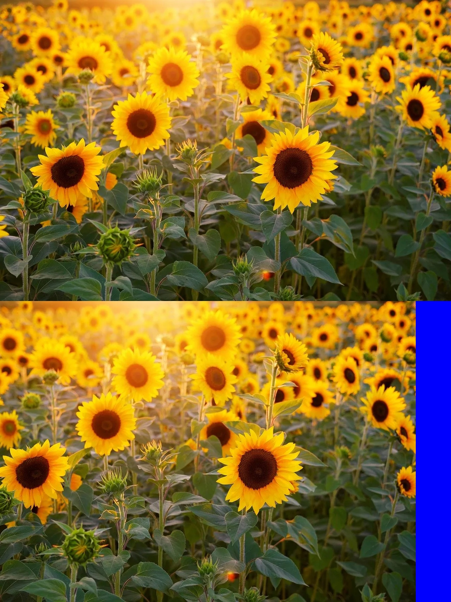
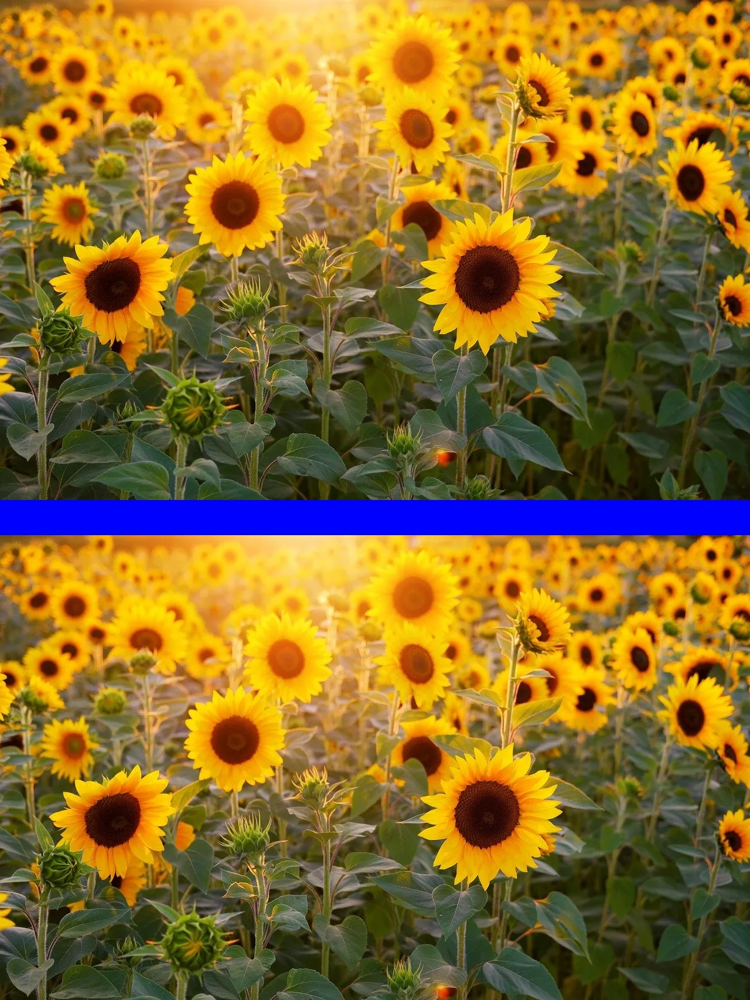
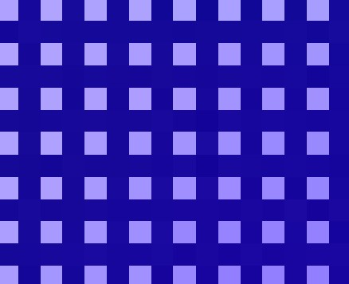
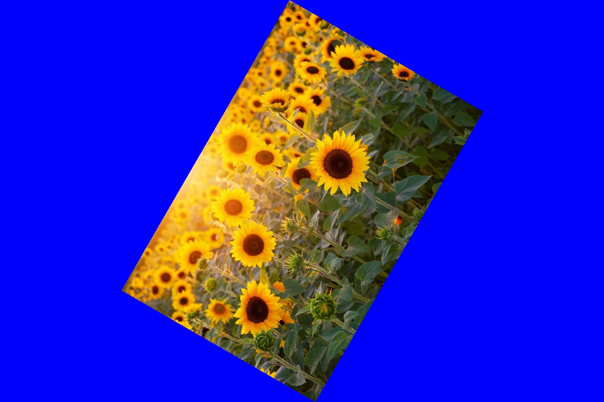

# Algorithm in Opencv

## Reference
[《OpenCV算法精解：基于Python与C++》(张平 编著)【简介_书评_在线阅读】 - 当当图书 (dangdang.com) http://product.dangdang.com/25182999.html](http://product.dangdang.com/25182999.html)

## shift

**run**
```
cd shift
python shift_.py
```
..............

## scale

**run**
```
cd scale
python scale_.py
```


按照某一点来缩放的

..............

## rotate

**run**
```
cd rotate
python rotate_.py
```


## calculate_transform_matrix

**run**
```
cd calculate_transform_matrix
python getaffinetransform.py
```


## Insertion

**run**
```
cd insert
python neighbor_insert.py 
```

neighbor_insert, compared with no insertion.


no insertion.


**run**
```
cd insert
python rotate__.py 
```

rotate__ , compared with no insertion.


no insertion.


**run**
```
cd insert
python getaffinetransform__.py 
```

getaffinetransform__ , compared with no insertion.



no insertion.

